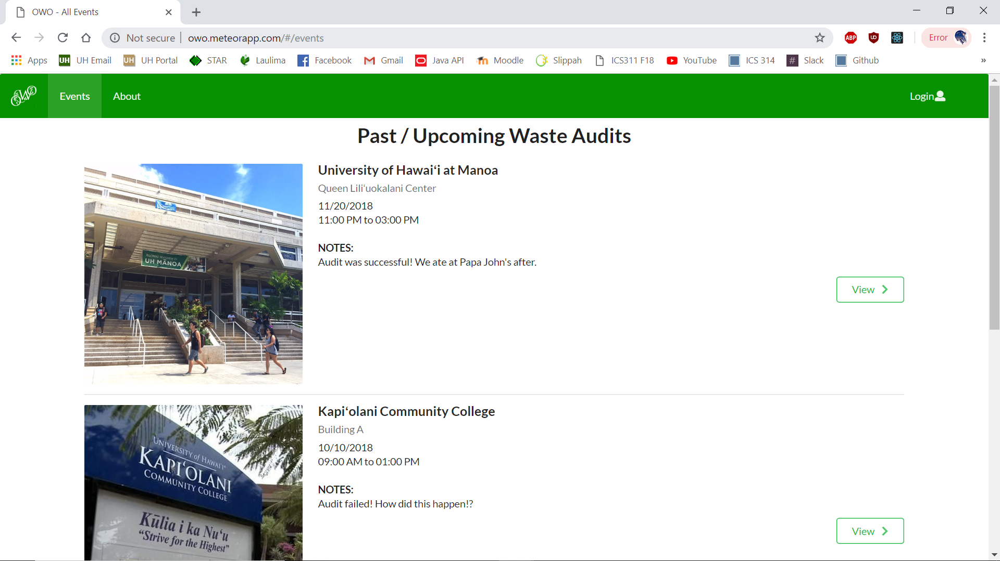
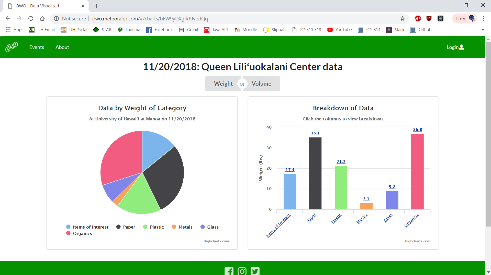

# Table of contents

* [About Oahu Waste Organizer 2018](#about)
  * [Links](#links)
  * [User Guide](#user-guide)
* [Installation](#installation)
* [Development history](#development-history)
  * [Milestone 1: Mockup development](#milestone-1-mockup-development)
  * [Milestone 2: Data Implementation](#milestone-2-data-implementation)
  * [Milestone 3: Final Touches](#milestone-3-final-touches)

## About
Currently, trash audits across UH campuses have a very primitive way of storing and calculating data. It consists of a single piece of paper and one very hard working individual. One representative is in search of a more streamlined solution of storing the data.

Our solution to this problem is to create a user-friendly web application that utilizes intuitive design to streamline data input and visualization. In other words, make trash data more pretty! In this way, the need for physical pencil and paper is eliminated, relieving the stress of getting a physical copy dirty and converting the copy manually into charts and graphs. This is a quick and sustainable solution that makes a tedious job easy.

Our final project consists of members Alton Lee, Emily Pang, and Jake Weber. Our project is inspired by our HACC team consisting of Leighton Villanueva, Alton Lee, Emily Pang, Jake Weber, Nicholas Lum, Ethan Chow, Jordan Ooka, Cristian Aspacio, and Ty Uehara.

### Links
You can view our deployed app <a href="http://owo.meteorapp.com/">here</a>.
Our GitHub page is located <a href="https://github.com/oahu-waste-organizer/oahu-waste-organizer/">here</a>.

## User Guide

When users first go to the Oahu Waste Organizer website (found at <a href="http:owo.meteorapp.com/">http://owo.meteorapp.com</a>), they are greeted with the home page.

In the events tab, anyone is free scroll through the list of upcoming and previous events, and choose to view the information of each one.

Information of each audit can be viewed in minimalist-styled yet detailed graphs and charts. 

If a user is a participant of a trash audit, they can log in through the login button at the top right of the navbar and gain access to an additional option on the events page to input data for a particular event.

The input data page allows the user to enter the campus, building, date, etc. There are dynamic boxes that represent trash bags; the user is able to add a new bag and choose the category of item that is sorted in each bag along with the weight, volume, etc. The data inputted into this form will immediately be available in graph form on the website under the event's information.

Through the About tab, the user can gain a further insight on what trash audits are about, the overall mission and long-term goals of these projects, and the effects of holding trash audits on various UH campuses.

## Installation
To begin, <a href="https://www.meteor.com/install">install Meteor</a>.

Then, download <a href="https://github.com/oahu-waste-organizer/oahu-waste-organizer">OWO</a>.

Then cd into the app directory and install the libraries with:

<code>$ meteor npm install
</code>

After the libraries have been installed, run the app using:

<code>$ meteor npm run start
</code>

You many also have to install Highcharts.js, run the app using:

<code>$ npm install highcharts-react-official
</code>

If done correctly, some default users and data will be created. 

You can then open up <a href="http://localhost:3000/#/">http://localhost:3000</a> to view the template application and can log in using the credentials in <a href="https://github.com/ics-software-engineering/meteor-application-template-react/blob/master/config/settings.development.json">settings.development.json</a>.

## Development History
We have sectioned off work into three milestones: Mockup Development, Data Implementation, and Final Touches.

### Milestone 1 Mockup Development
<a href=https://github.com/oahu-waste-organizer/oahu-waste-organizer/projects/1>Milestone 1 on GitHub.</a>

A page idea we could use is a form that simplifies trash input that any logged in user can add. Bags and Categories can be added as needed. Our home page is accessible to the general public and contains information and data of previous years of trash auditing. The home page also links to a heat map of the different campuses and how much trash each building produces on each campus.

The input form will imitate the paper excel sheet used at the UH trash audits.

### Milestone 2: Data Implementation
<a href=https://github.com/oahu-waste-organizer/oahu-waste-organizer/projects/2>Milestone 2 on Github.</a>

For milestone 2, we focused on implementing our databse with our mockups to actually input and display the data we could collect and input.

We also implemented the data from our database to display the data from the audits in graphs and charts to help visualize data.

### Milestone 3: Final Touches
asdfghjkl :)

