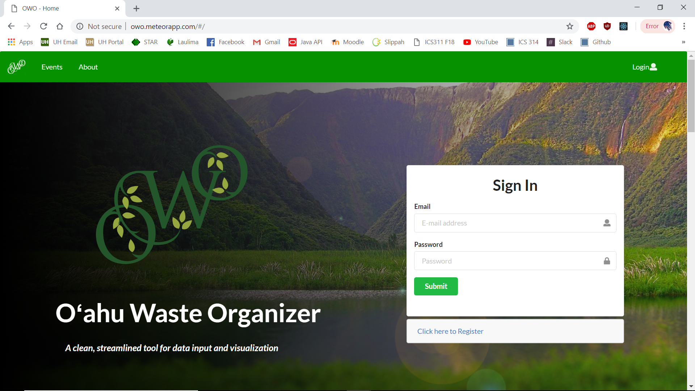
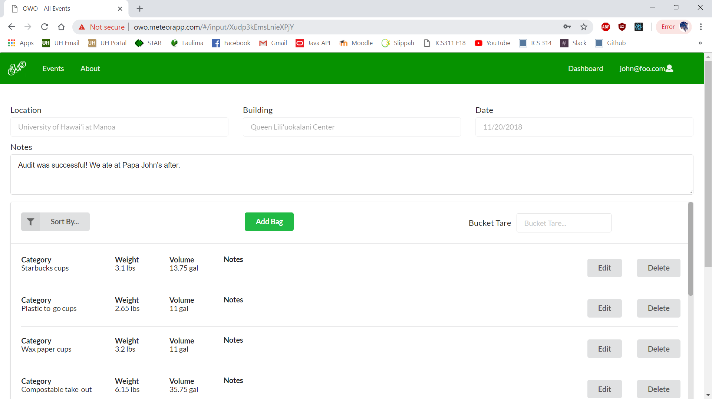
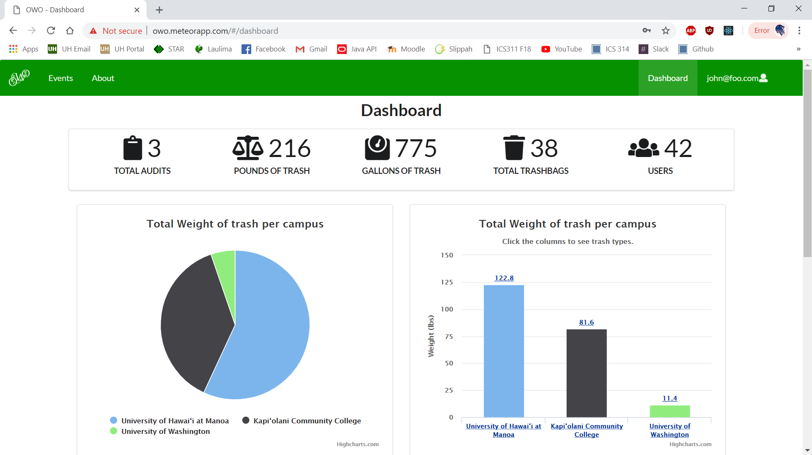
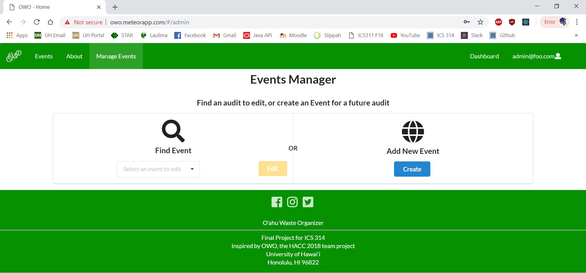
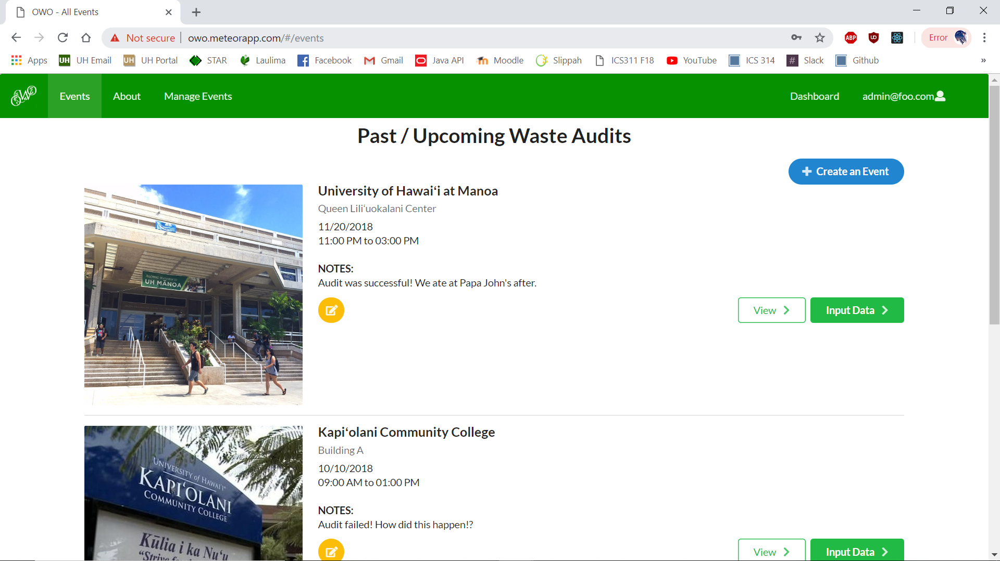
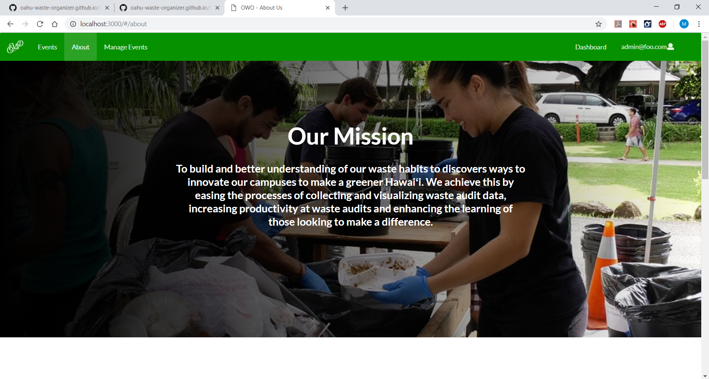

# Oahu Waste Organizer


## Table of contents

* [Current Deployed App](http://owo.meteorapp.com/)
* [GitHub page](https://github.com/oahu-waste-organizer/oahu-waste-organizer/)
* [About Oahu Waste Organizer 2018](#about)
  * [Links](#links)
  * [User Guide](#user-guide)
  * [Installation](#installation)
* [Development history](#development-history)
  * [Milestone 1: Mockup development](#milestone-1-mockup-development)
  * [Milestone 2: Data Implementation](#milestone-2-data-implementation)
  * [Milestone 3: Final Touches](#milestone-3-final-touches)

## About
Currently, trash audits across UH campuses have a very primitive way of storing and calculating data. It consists of a single piece of paper and one very hard working individual. One representative is in search of a more streamlined solution of storing the data.

Our solution to this problem is to create a user-friendly web application that utilizes intuitive design to streamline data input and visualization. In other words, make trash data more pretty! In this way, the need for physical pencil and paper is eliminated, relieving the stress of getting a physical copy dirty and converting the copy manually into charts and graphs. This is a quick and sustainable solution that makes a tedious job easy.

Our final project consists of members Alton Lee, Emily Pang, and Jake Weber. Our project is inspired by our HACC team consisting of Leighton Villanueva, Alton Lee, Emily Pang, Jake Weber, Nicholas Lum, Ethan Chow, Jordan Ooka, Cristian Aspacio, and Ty Uehara.

## Links
* [Deployed app](http://owo.meteorapp.com/)
* [GitHub page](https://github.com/oahu-waste-organizer/oahu-waste-organizer/)

## User Guide

When users first go to the Oahu Waste Organizer (abbreviated O.W.O.) web application, they are greeted with the home page. Here they can marvel at our background and learn a bit about waste auditing. 



In the events tab, anyone can view through the list of upcoming and previous events, and choose to view the information of each one. Events are sorted by most recent event. 


Information of each audit can be viewed in minimalist-styled yet detailed graphs and charts. Charts can be toggled to display by either category weight or category volume. The bar graph on the right can be interacted with to view the breakdown of that category. 


If a user is a participant of a trash audit, they can log in through the login button at the top right of the navbar or through the home page and gain access to an additional option on the events page to input data for a particular event.


The input data page allows the user to enter the campus, building, date, etc. There are dynamic boxes that represent trash bags; the user is able to add a new bag and choose the category of item that is sorted in each bag along with the weight, volume, etc. The data inputted into this form will immediately be available in graph form on the website under the event's information.



Additionally, a more in-depth statistics page is available through the Dashboard tab which is only available to registered users or administrators. The page features a range of statistics at the top, with more in-depth graphs following it.



Through the About tab, the user can gain a further insight on what trash audits are about, the overall mission and long-term goals of these projects, and the effects of holding trash audits on various UH campuses. Here they can also learn a bit more about the team behind the project, and other contact information. 


Additionally, if the user is an admin, an Events Manager tab is visible, where they can create new events or edit a prexisting event.



The admin also has access to these options from the Events page as well.



## Installation Guide
To begin, [install Meteor](https://www.meteor.com/install).

Then, download [O.W.O](https://github.com/oahu-waste-organizer/oahu-waste-organizer). Copy the following files and directories into a local workspace:

* app/
* config/
* .gitignore

These files contain the O.W.O. template. 

Then cd into the app directory and install the libraries with:
```
$ meteor npm install
```

After the libraries have been installed, run the app using:
```
$ meteor npm run start
```

You many also have to install Highcharts.js, run the app using:
```
$ npm install highcharts-react-official
```

If done correctly, some default users and data will be created. The command window should look like this:
```
> meteor-application-template-react@ start {directory}/app
> meteor --no-release-check --settings ../config/settings.development.json
 
[[[[[ ~{directory}/app ]]]]]
 
=> Started proxy.                             
=> Started MongoDB.                           
I20181130-00:00:00.915(-10)? Creating the default user(s)
I20181130-00:00:00.915(-10)?   Creating user admin@foo.com.
I20181130-00:00:00.918(-10)?   Creating user john@foo.com.
I20181130-00:00:00.918(-10)? Creating sample data.
I20181130-00:00:00.919(-10)?   Adding: Building A audit data
I20181130-00:00:00.919(-10)?   Adding: Queen Liliuokalani Center audit data
I20181130-00:00:00.920(-10)?   Adding: Johnson Building audit data

=> Started your app.

=> App running at: [http://localhost:3000](http://localhost:3000)
```

You can then open up [http://localhost:3000](http://localhost:3000) to view the template application and can log in using the sample credentials located [here](https://github.com/oahu-waste-organizer/oahu-waste-organizer/blob/master/config/settings.development.json).

## Development History
We have sectioned off work into three milestones: Mockup Development, Data Implementation, and Final Touches.
* [Milestone 1](#milestone-1-mockup-development)
  * Mockup pages
* [Milestone 2](#milestone-2-data-implementation)
  * Event collection
  * Dynamic events page
  * Dynamic charts and graphs
* [Milestone 3](#milestone-3-final-touches)
  * Coming soon!

### Milestone 1: Mockup Development
View Milestone 1 [here.](https://github.com/oahu-waste-organizer/oahu-waste-organizer/projects/3)

A page idea we could use is a form that simplifies trash input that any logged in user can add. Bags and Categories can be added as needed. Our home page is accessible to the general public and contains information and data of previous years of trash auditing. The home page also links to a heat map of the different campuses and how much trash each building produces on each campus.


The input form will imitate the paper excel sheet used at the UH trash audits.


### Milestone 2: Data Implementation
View Milestone 2 [here.](https://github.com/oahu-waste-organizer/oahu-waste-organizer/projects/3)

We significantly changed the application for this milestone. For Milestone 2, we focused on implementing our database into our frontend, adding functionality to a page that lists events dynamically. 


We also implemented the data from our database to display the data from the audits in graphs and charts to help visualize data.


### Milestone 3: Final Touches
View Milestone 3 [here.](https://github.com/oahu-waste-organizer/oahu-waste-organizer/projects/3)

For Milestone 3, we cleaned up of UI and improved the functionality of our input page and added features such as a dynamic dashboard to compare and view data.

The home page was updated for a cleaner look, with additional content on the uses of the OWO app.


A dashboard that pulled statistics from the database was added for registered users and administrators to view.


The input page was also updated, with improved Add Bag functionality.


The about page was also updated to provide a mission statement, the background of our app, and contact information.




